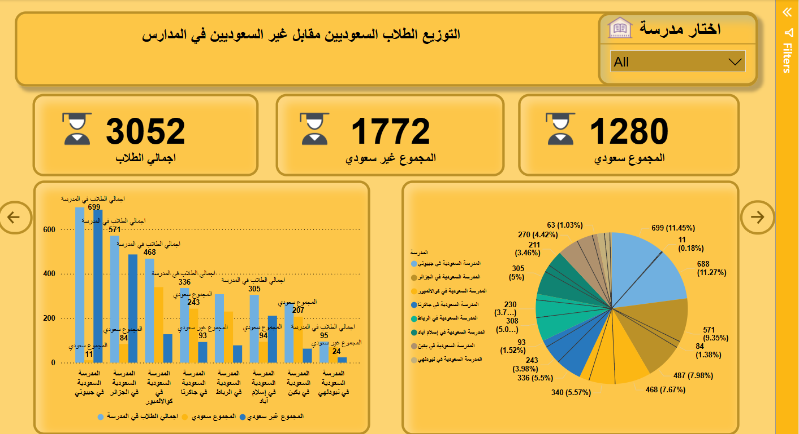
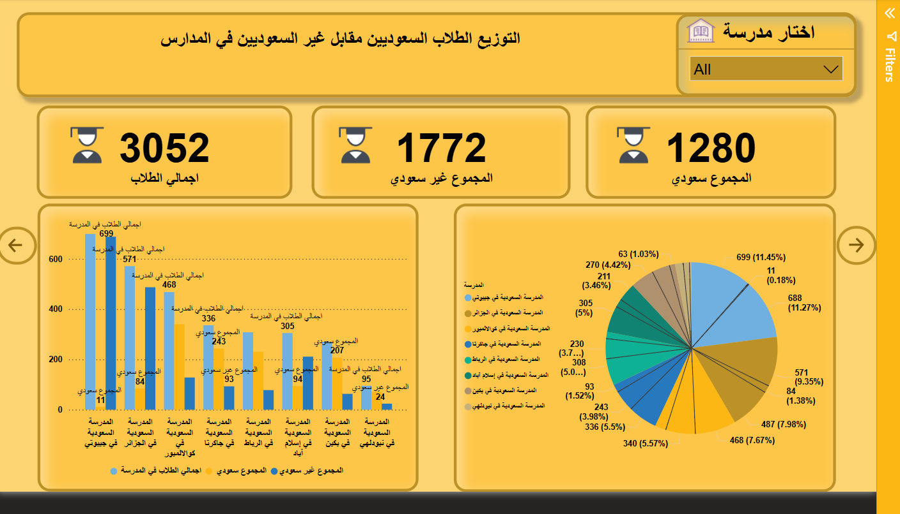
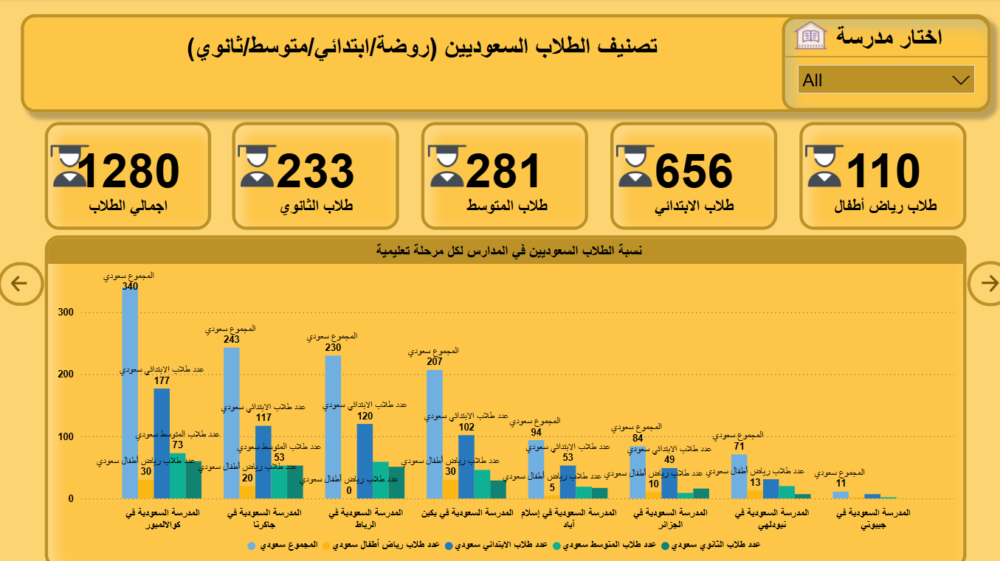
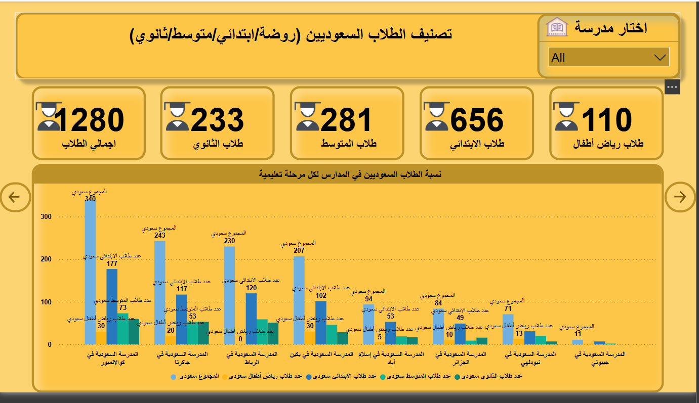

# 🏫 Saudi Schools Abroad Data Analysis 2025


# **Translate**
[](Docs/Translate/README.ar.md)


## 📋 Overview
This project focuses on analyzing student data from Saudi schools abroad for the year 2025, with the aim of extracting valuable insights about the distribution of Saudi and non-Saudi students across different educational stages in eight countries. The analysis helps in making strategic decisions to develop the external educational system.

## 📊 Data Used
The data includes statistics on:
- Number of Saudi and non-Saudi students in each school
- Distribution of students by educational stages (kindergarten, primary, intermediate, secondary)
- Total number of students in each school

## 🔍 Key Findings
- The Saudi school in Djibouti has the largest number of non-Saudi students (688 students)
- The Saudi school in Kuala Lumpur has the largest number of Saudi students (340 students)
- There is a significant variation in the ratio of Saudi to non-Saudi students across different schools
- The primary stage constitutes the largest percentage of the total number of students in most schools

## 🛠️ Technologies Used
- **Power BI**: For creating interactive analytical dashboards
- **Excel**

## 📂 Project Structure
```
📦 Saudi-Schools-Abroad-Analysis
├── 📁 data                 # Raw and processed data
│   └── 📄 Number of Students in Saudi Schools Abroad2025.csv
├── 📁 visualizations       # Power BI dashboards and chart images
│   └── 📄 dashboard.pbix
├── 📁 Docs
     └── 📁 Translate
          └── 📄 README.ar.md  # Translate documentation
└── 📄 README.md            # Project documentation
```

## 📊 Main Visualizations

### Student Distribution by Nationality
Chart showing the percentage of Saudi and non-Saudi students in each school.

### Student Distribution by Educational Stages
Comparative analysis of educational stages across all schools.

### Geographic Distribution Pattern
Heat map showing the concentration of Saudi students in foreign schools.

### Trend Analysis
Comparison between schools in terms of growth rates and development.

# 📊 Student Distribution Dashboards

This folder contains visual dashboards showing the distribution of Saudi and non-Saudi students across various schools, including detailed breakdowns by education levels.



## Title: Distribution of Saudi vs Non-Saudi Students in Schools

### Description:

- Total students: 3052

- Saudi students: 1280

- Non-Saudi students: 1772

Bar chart shows the number of students per school, split by nationality.

Pie chart displays the percentage share of each school in terms of student population.



## Title: Distribution of Saudi vs Non-Saudi Students in Schools (Duplicate View)

### Description:

Same data and visuals as Dashboard no1.png, possibly a resized or alternate version.

Useful for cross-reference or layout comparison.



## Title: Classification of Saudi Students by Education Level (KG/Primary/Intermediate/Secondary)

### Description:

Total Saudi students: 1280, divided into:

- Kindergarten: 110

- Primary: 656

- Intermediate: 281

- Secondary: 233

Bar chart shows the distribution of Saudi students across schools and education levels.



## Title: Saudi Student Breakdown by Education Stage (Duplicate View)

### Description:

Same data and chart as Dashboard no2.png, showing the same classifications.

May differ slightly in display or formatting.


## 🚀 Installation and Usage
1. Clone the repository:
    ```bash
    git clone https://github.com/turki013/Saudi-Schools-DataAnalysis-2025.git
    cd Saudi-Schools-DataAnalysis-2025
    ```

2. Explore Power BI dashboards:
   - Open the file `visualizations/dashboard.pbix` using Power BI Desktop

## 💡 Suggested Applications
- Evaluating resource distribution among Saudi schools abroad
- Studying the need to expand or redistribute capacity
- Analyzing cultural diversity in schools and its impact on the educational system
- Comparing the performance of different schools and extracting best practices

## 👥 Contributing
Contributions from all interested parties are welcome! You can:
- Submit suggestions to improve the analysis
- Help develop additional Power BI dashboards
- Improve data processing and analysis methods

## 📞 Contact
For inquiries or more information:

<a href="https://t.me/DataScience18" target="_blank">
    
  </a>

---

